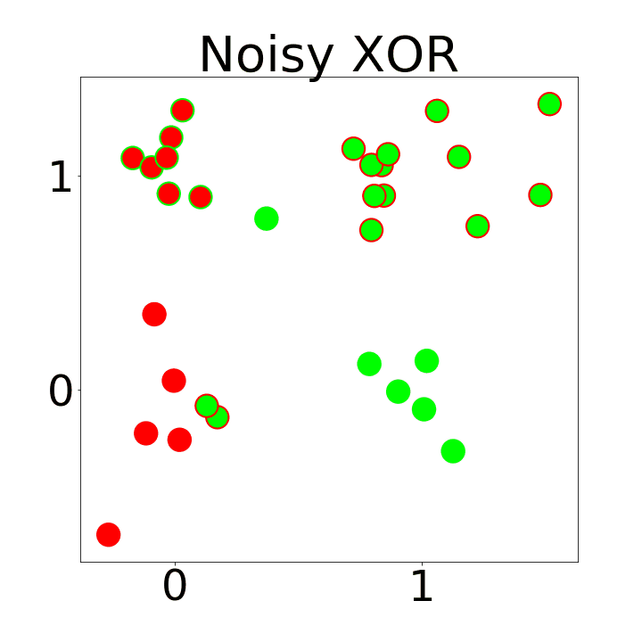

# Quantum XOR: the learning way

We all know that a single layer perceptron (or a perceptron with multiple linear layers) can't learn to separate the XOR truth table, which is a non-linear function. In conventional artificial neural networks, learning XOR becomes easy with the addition of a hidden layer with a non-linear activation function.

<em>A QNN learns to distinguish the exclusive OR function on noisy data.</em>

# Quantum XOR with CNOT

Of course, computing XOR in a differentiable quantum circuit/quantum neural network is no more practical than training a multilayer perceptron to do the same classically. Instead we can use the CNOT gate, a two-qubit quantum gate that flips the second qubit when the first is set. The 4 by 4 matrix for CNOT can be written as: 

$$\begin{bmatrix}
1 & 0 & 0 & 0 \\
0 & 1 & 0 & 0 \\
0 & 0 & 0 & 1 \\
0 & 0 & 1 & 0 \\
\end{bmatrix}$$

Writing the truth table for this operation we have: 

$$
|00\rangle \rightarrow |00\rangle \\ 
|01\rangle \rightarrow |01\rangle \\ 
|10\rangle \rightarrow |11\rangle \\ 
|11\rangle \rightarrow |10\rangle \\ 
$$

